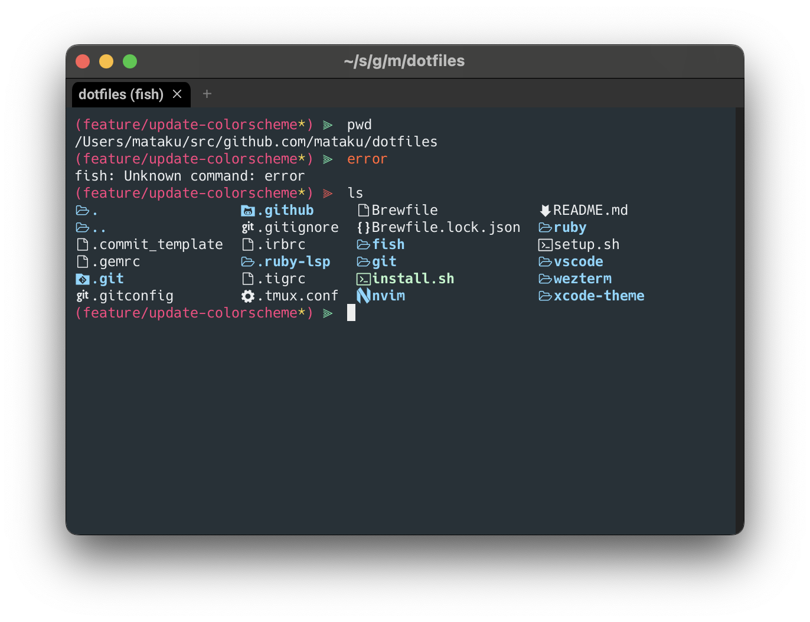
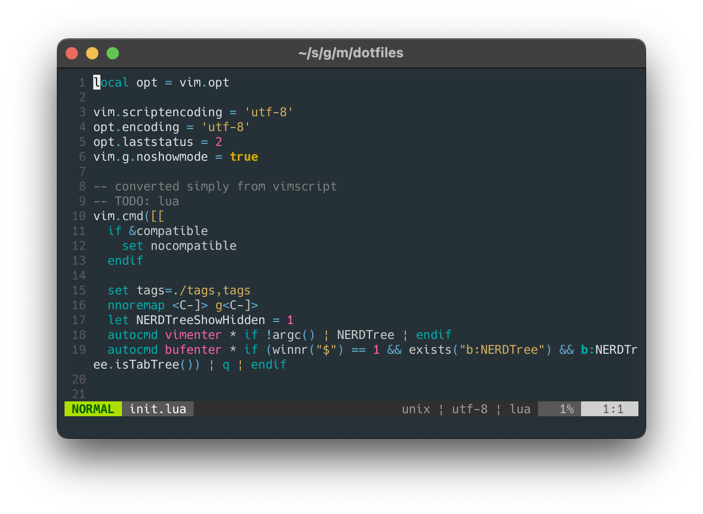

## Installation

```shell
/bin/bash setup.sh
```

## Screenshots

<table width="100%">
  <thead>
    <tr>
      <th align="center">WezTerm</th>
      <th align="center">Neovim</th>
    </tr>
  </thead>
  <tbody>
    <tr>
      <td width="50%"></td>
      <td width="50%"></td>
    </tr>
  </tbody>
</table>

