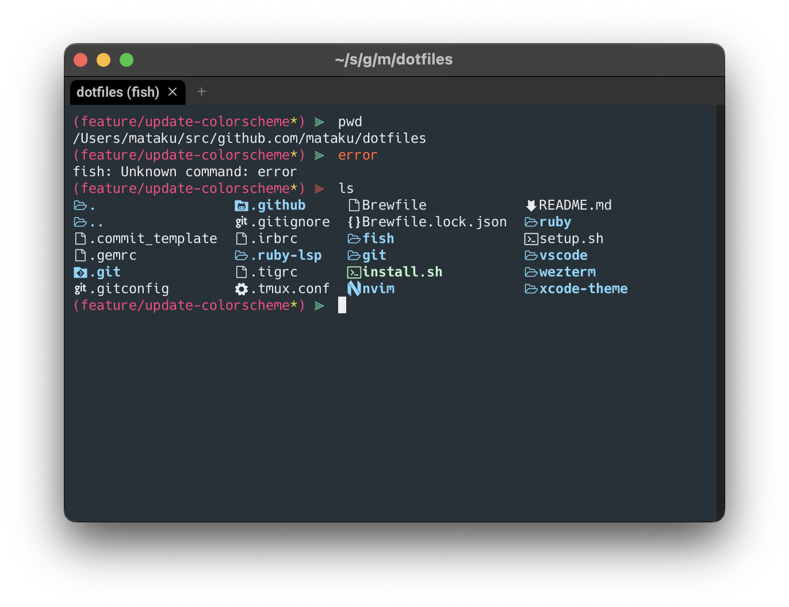
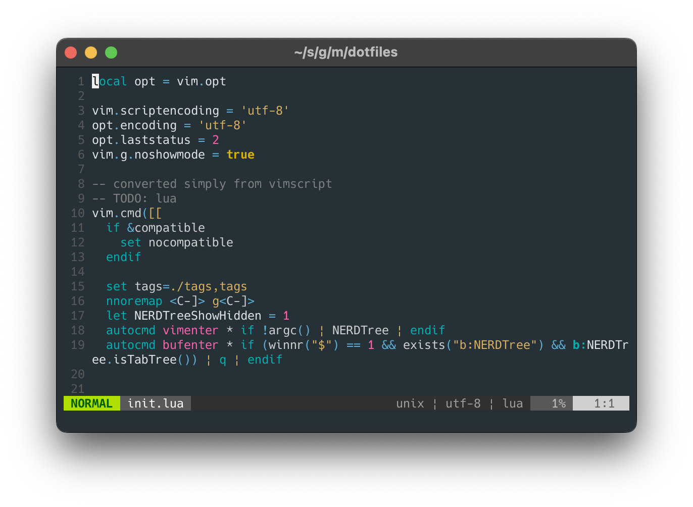

## Install

```sh
curl -fsSL https://raw.githubusercontent.com/mataku/dotfiles/develop/setup.sh | sh
```

The bootstrap script installs the Xcode Command Line Tools (if missing), clones this repository to `~/src/github.com/mataku/dotfiles`, then hands off to `scripts/install.sh` which installs Nix and activates the nix-darwin configuration.

## Documentation

- [Usage Guide](docs/usage.md) - Daily workflows, package management, manual app list, private settings, and troubleshooting

## Screenshots

<table width="100%">
  <thead>
    <tr>
      <th align="center">WezTerm</th>
      <th align="center">Neovim</th>
    </tr>
  </thead>
  <tbody>
    <tr>
      <td width="50%"></td>
      <td width="50%"></td>
    </tr>
  </tbody>
</table>

## Acknowledgements

My WezTerm theme is based on [https://github.com/MartinSeeler/iterm2-material-design](https://github.com/MartinSeeler/iterm2-material-design).
